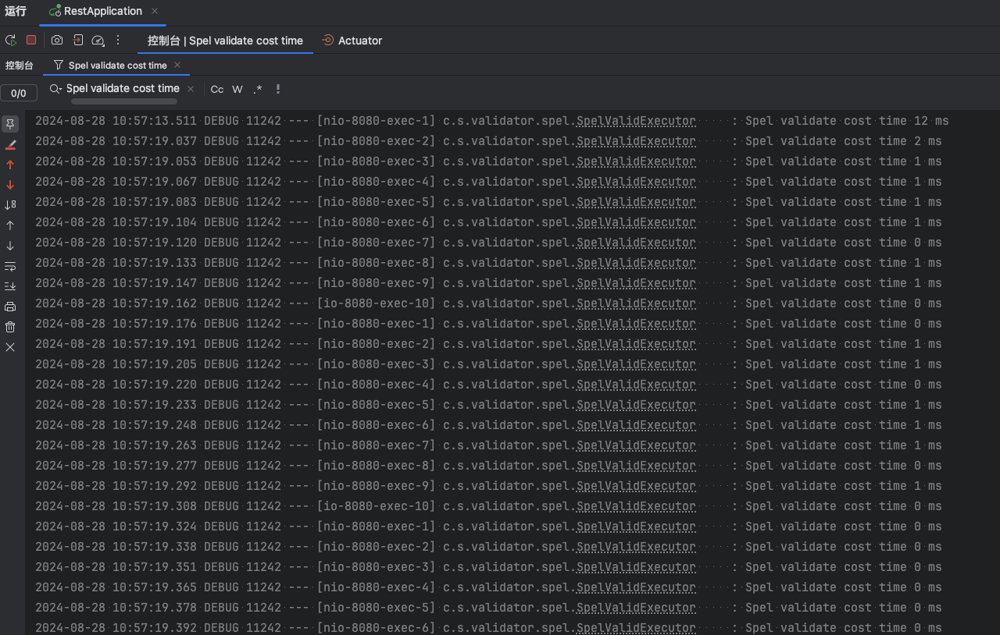
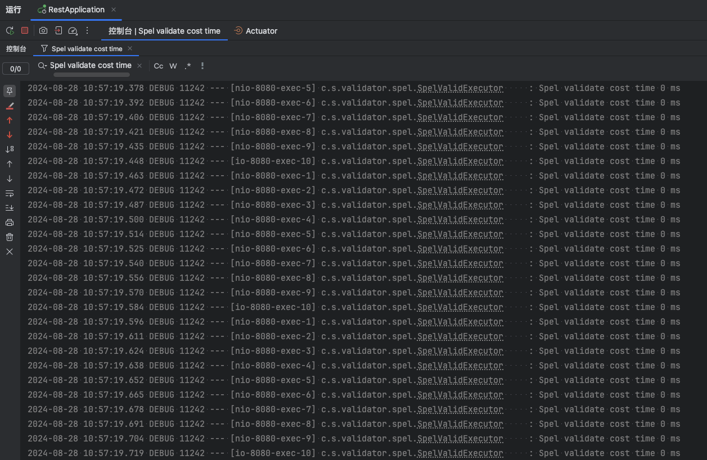
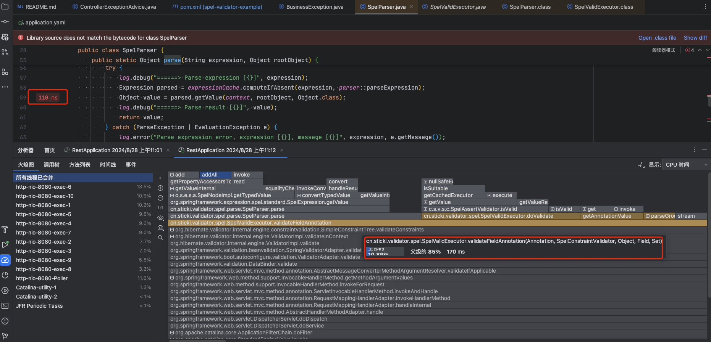

# 常见问题

## 关于性能

我对[示例项目](https://github.com/stick-i/spel-validator-example)创建了一组简单的api测试用例，共15个请求，在后面的测试中，我会使用它们来进行测试。


::: tip 测试环境

- Mac mini 2023款，M2芯片，16G内存
- 示例项目的接口中无业务逻辑，只有参数校验
- SpEL Validator 版本：v0.2.0-beta
- JDK版本：8
- SpringBoot版本：2.7.17

:::

### 执行耗时

测试条件：

- 开启debug日志
- 接口未预热
- 使用Apifox进行2线程3循环的测试，共90次请求

测试结果：

除了前几次请求耗时会达到 10ms 以上，
后续请求耗时会稳定在 0~1ms 左右。




其中每条记录表示一次接口调用的完整校验耗时。

### 火焰图

测试条件：

- 关闭debug日志
- 接口充分预热
- 使用 Apifox 进行10线程10循环的测试，共1500次请求
- 使用 IDEA 自带的 IntelliJ Profiler 进行分析

得到如下的火焰图




可以看到，本组件的总耗时为170ms，平均每个请求耗时约0.11ms。

其中解析SpEL表达式的总耗时为110ms，占比约65%。

随后我在不同的数量的线程和循环次数后重新测试，得到的结果如下：

- 5线程100循环，共7500次请求，总耗时约为 930ms，平均每个请求耗时约0.12ms，其中解析SpEL表达式的总耗时为 420ms，占比约45%。
- 20线程，30循环，共9000次此请求，总耗时约为 1190ms，平均每个请求耗时约0.13ms，其中解析SpEL表达式的总耗时为 390ms，占比约33%。

这样看来，目前的性能表现还算可以接受，但还有优化空间，后续会继续优化。

## 如何对实体类单独进行校验

正常情况下，只需要触发 jakarta.validation-api 的校验，就会顺带触发 spel.validator 的校验。
这一点可以参考下源码的测试工具`cn.sticki.spel.validator.jakarta.JakartaSpelValidator.validate`的实现，大概是下面这个样子：

```java
    private static final Validator validator = Validation.byDefaultProvider()
        .configure()
        .messageInterpolator(new ParameterMessageInterpolator())
        .buildValidatorFactory().getValidator();

    /**
     * 参数校验
     * <p>
     * 调用此方法会触发 jakarta.validation.constraints.* 的校验，类似于使用 @Valid 注解
     *
     * @return 校验结果，如果校验通过则返回空列表
     */
    public static <T> Set<ConstraintViolation<T>> validate(T obj) {
        return validator.validate(obj);
    }
```

如果你的实体类中只有 spel.validator 的校验注解，或者你只想触发 spel.validator 的校验，
那更简单，你只需要调用 `cn.sticki.spel.validator.core.SpelValidExecutor#validateObject` 即可触发校验。
