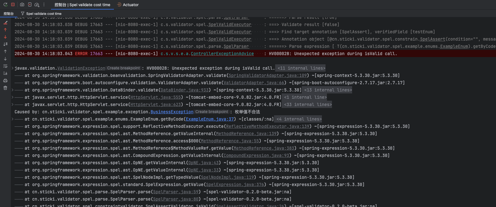

# 使用指南

::: warning

本组件的目的不是代替 `jakarta.validation-api` 的校验注解，而是作为一个扩展，方便某些场景下的参数校验。

原则上来说，能够使用 `jakarta.validation-api` 处理的场景就不应该使用 `spel-validator` 。

:::

## 支持的版本

| 组件                       | JDK | SpringBoot |
|--------------------------|-----|------------|
| spel-validator-core      | 8+  | 2.x, 3.x   |
| spel-validator-constrain | 8+  | 2.x, 3.x   |
| spel-validator-javax     | 8+  | 2.x        |
| spel-validator-jakarta   | 11+ | 3.x        |

一般情况下，您只需要考虑使用 `-javax` 或 `-jakarta` 这两个版本即可。

## 添加依赖

Latest Version:
[](https://central.sonatype.com/search?q=g:cn.sticki%20a:spel-validator-root)

根据项目的实际情况，引入 `spel-validator-javax` 或 `spel-validator-jakarta` ：

```xml
<dependencys>
  <dependency>
    <groupId>cn.sticki</groupId>
    <artifactId>spel-validator-jakarta</artifactId>
    <version>0.4.1-beta</version>
  </dependency>
</dependencys>
```

如果你的项目中没有任何对于Spring的依赖，那么你需要额外添加一个对SpEL的依赖：

```xml
<dependencys>
  <!-- SpEL 依赖项 -->
  <dependency>
    <groupId>org.springframework</groupId>
    <artifactId>spring-expression</artifactId>
    <version>${spring.version}</version>
  </dependency>
</dependencys>
```

## 开启约束校验

需要满足以下两个条件，才会对带注解的元素进行校验：

1. 在接口参数上使用 `@Valid` 或 `@Validated` 注解

```java
@RestController
@RequestMapping("/example")
public class ExampleController {

  @PostMapping("/simple")
  public Resp<Void> simple(@RequestBody @Valid /*添加启动注解*/ SimpleExampleParamVo simpleExampleParamVo) {
    return Resp.ok(null);
  }

}
```

2. 在实体类上使用 `@SpelValid` 注解

```java
@Data
@SpelValid /*添加启动注解*/
public class SimpleExampleParamVo {
  // ...
}
```

如果只满足第一个条件，那么只会对带 `@NotNull`、`@NotEmpty`、`@NotBlank` 等注解的元素进行校验。

如果只满足第二个条件，那么不会对任何元素进行校验。

这是因为 `@SpelValid` 注解是基于 `jakarta.validation.Constraint` 实现的。
这就意味着，`@SpelValid` 和 `@NotNull`、`@NotEmpty`、`@NotBlank` 等注解一样，
需要在 `@Valid` 或 `@Validated` 注解的支持下才会生效。

而 `SpEL Validator` 提供的约束注解又是在 `@SpelValid` 的内部进行校验的，只有在 `@SpelValid` 注解生效的情况下才会执行约束校验。

所以，如果需要使用 `SpEL Validator` 进行校验，需要同时满足上述两个条件。

::: tip

如果你使用 `@Validated` 的话，那么你也可以这样使用：

```java
@Validated // 此处开启了支持参数的约束校验
@RestController
@RequestMapping
public class TestController {

    @PostMapping
    public void test(@RequestBody @Validated/*此处开启了对象内的校验*/ @SpelValid/*此处开启了对象内的spel校验*/ TestParamVo param) {
    }

}

@Data // 这里不再需要额外添加 @SpelValid 注解
public class TestParamVo {

  @SpelNotNull
  private Integer id;

  @SpelNotNull
  private String name;

  @NotNull
  private String phone;

}
```

:::

### 设置开启条件

`@SpelValid` 注解包含一个属性 `condition`，支持 SpEL 表达式，计算结果必须为 `boolean` 类型。

当 **表达式的算结果为true** 时，表示开启校验，默认情况下也是开启的。

```java
@Data
@SpelValid(condition = "1 > 0") /*设置开启校验的条件*/
public class SimpleExampleParamVo {
  // ...
}
```

这里的 `condition` 字段同样支持上下文引用，具体使用方式参考 [引用上下文字段](#引用上下文字段)。


## 使用约束注解

目前支持的约束注解有：

|       注解        |       说明        | 对标 jakarta.validation-api |
|:---------------:|:---------------:|:-------------------------:|
|  `@SpelAssert`  |     逻辑断言校验      |       `@AssertTrue`       |
| `@SpelNotNull`  |    非 null 校验    |        `@NotNull`         |
| `@SpelNotEmpty` | 集合、字符串、数组大小非空校验 |        `@NotEmpty`        |
| `@SpelNotBlank` |    字符串非空串校验     |        `@NotBlank`        |
|   `@SpelNull`   |   必须为 null 校验   |          `@Null`          |
|   `@SpelSize`   |  集合、字符串、数组长度校验  |          `@Size`          |
|   `@SpelMin`    |      即将支持       |          `@Min`           |
|   `@SpelMax`    |      即将支持       |          `@Max`           |

所有约束注解都包含三个默认的属性：

- `condition`：约束开启条件，支持 SpEL 表达式，表达式的计算结果必须为 `boolean` 类型，当 **计算结果为true** 时，才会对带注解的元素进行校验，默认情况下开启。
- `message`：校验失败时的提示信息。
- `group`：分组条件，支持 SpEL 表达式，当分组条件满足时，才会对带注解的元素进行校验。具体使用方式参考 [分组校验](#分组校验)。

在需要校验的字段上使用 `@SpelNotNull` 等约束注解。

```java
@Data
@SpelValid
public class SimpleExampleParamVo {

  /**
   * 此处使用了 @SpelNotNull 注解
   * 当参数 condition 的计算结果 true 时，会启用对当前字段的约束，要求为当前字段不能为null
   * 约束校验失败时，提示信息为：语音内容不能为空
   */
  @SpelNotNull(condition = "true", message = "语音内容不能为空")
  private Object audioContent;

}
```


## 引用上下文字段

设计这套组件的初衷，就是为了满足一些需要判断另一个字段的值来决定当前字段是否校验的场景。

在组件内部，将当前校验的整个类对象作为了 SpEL 表达式解析过程中的根对象，所以在表达式中可以直接引用类中的任意字段。

通过 `#this.fieldName` 的方式来引用当前类对象的字段。

```java
@Data
@SpelValid
public class SimpleExampleParamVo {

  private boolean switchAudio;

  /**
   * 此处引用了上面的 switchAudio 字段
   * 当 switchAudio 字段的值为 true 时，才会校验 audioContent 是否为null
   */
  @SpelNotNull(condition = "#this.switchAudio == true")
  private Object audioContent;

}
```


## 分组校验

启动注解 `@SpelValid` 上包含一个属性 `spelGroups`，类型为字符串数组，支持 SpEL 表达式。

每一个[约束注解](#使用约束注解)上也都包含一个属性 `group`，类型为字符串数组，支持 SpEL 表达式。

::: tip 为什么 @SpelValid 注解上的 spelGroups 属性不叫 groups？

因为 `@SpelValid` 注解是基于 `jakarta.validation.Constraint` 实现的，而 `Constraint` 中已经有一个 `groups` 属性了，故命名为 `spelGroups`。

在使用 `@SpelValid` 的时候，你可以同时使用 `groups` 和 `spelGroups` 属性，但是 `groups` 属性只能用于 `jakarta.validation-api` 的分组校验。
`@SpelValid` 和 `@NotNull`、`@NotEmpty` 等注解是兄弟关系，它的 `groups` 属性同样受上层 `@Valid` 或 `@Validated` 注解的影响。

:::

默认情况下，`@SpelValid.spelGroups` 为空，表示不进行分组校验，此时所有的约束注解都会生效。

当 `@SpelValid.spelGroups` 不为空时，表示开启分组校验，此时：

- 约束注解中的 `group` 属性为空时，该约束注解生效。
- 约束注解中的 `group` 属性不为空时，只有当 `@SpelValid.spelGroups` 中的分组信息与此处的分组信息有交集时，才会对带注解的元素进行校验。

这里表达式的计算结果可以是任何类型，但只有两个计算结果满足 `o.equals(e)` 时，才被认为是相等的。

使用示例：

```java
@Data
@SpelValid(spelGroups = "#this.type")
public class GroupExampleParamVo {

  @NotNull
  @Pattern(regexp = "^text|audio$")
  private String type;

  /**
   * 当 type 字段的值为 text 时，才会对此字段进行校验
   */
  @SpelNotNull(group = "'text'")
  private Object textContent;

  /**
   * 当 type 字段的值为 audio 时，才会对此字段进行校验
   */
  @SpelNotNull(group = "'audio'")
  private Object audioContent;

  /**
   * 未指定分组，默认被校验
   */
  @SpelNotNull
  private Integer other;

}
```

使用示例2：

```java
@Validated // 注意这里
@RestController
@RequestMapping("/test/group")
public class GroupTestController {

  @PostMapping("/addUser")
  public void addUser(@RequestBody @Validated @SpelValid(spelGroups = GroupTestParamVo.Group.ADD) GroupTestParamVo add) {
  }

  @PostMapping("/updateUser")
  public void updateUser(@RequestBody @Validated @SpelValid(spelGroups = GroupTestParamVo.Group.UPDATE) GroupTestParamVo update) {
  }

}

@Data
public class GroupTestParamVo {

  @SpelNotNull(group = {Group.UPDATE})
  private Integer id;

  @SpelNotNull(group = {Group.UPDATE, Group.ADD})
  private String name;

  @NotNull
  private String phone;

  public static class Group {

    public static final String ADD = "'add'"; // SpEL表达式中的字符串需要使用单引号包裹，否则会被识别为变量

    public static final String UPDATE = "'audio'";

  }

}
```

## 嵌套校验

本组件支持嵌套校验，在需要校验的字段上添加 `@Valid`，以及在另一个类上添加 `@SpelValid` 注解。

```java
@Data
@SpelValid
public class TestParamVo {

  private Boolean switchVoice;

  @SpelNotNull(condition = "#this.switchVoice == true")
  private Object voiceContent;

  @Valid
  private TestParamVo2 testParamVo2;

}

@Data
@SpelValid /*在此处添加注解*/
public class TestParamVo2 {

  @SpelNotNull
  private Object object;

}
```

或者将 `@SpelValid` 注解转移到对应的字段上。

```java
@Data
@SpelValid
public class TestParamVo {

  private Boolean switchVoice;

  @SpelNotNull(condition = "#this.switchVoice == true")
  private Object voiceContent;

  @Valid
  @SpelValid /*在此处添加注解*/
  private TestParamVo2 testParamVo2;

}

@Data
public class TestParamVo2 {

  @SpelNotNull
  private Object object;

}
```

## 处理约束异常

当校验失败时，本组件会将异常信息上报到 `jakarta.validation-api` 的异常体系中。

正常情况下，你只需要处理 `org.springframework.web.bind.MethodArgumentNotValidException`
和 `org.springframework.validation.BindException` 这两个校验异常类就好了 ，而无需额外处理本组件的异常信息。

事实上，`MethodArgumentNotValidException` 继承自 `BindException`，只需要处理 `BindException` 就可以了。

```java
@RestControllerAdvice
public class ControllerExceptionAdvice {

  @ExceptionHandler({BindException.class, MethodArgumentNotValidException.class})
  public Resp<Void> handleBindException(BindException ex) {
    String msg = ex.getFieldErrors().stream()
        .map(error -> error.getField() + " " + error.getDefaultMessage())
        .reduce((s1, s2) -> s1 + "," + s2)
        .orElse("");
    return new Resp<>(400, msg);
  }

}
```

## 处理业务异常

由于本组件支持 [调用静态方法](spel.md#调用静态方法) 和 [调用Spring Bean方法](spel.md#调用-spring-bean)，故在校验过程中可能会抛出除约束异常以外的其他业务异常。

### 举一个不太恰当的例子

以下是一个枚举类，它包含了一个静态方法，用于根据code获取枚举值，如果获取不到则抛出业务异常：

```java
@Getter
public enum ExampleEnum {

  XXX(1);

  private final Integer code;

  ExampleEnum(Integer code) {
    this.code = code;
  }

  /**
   * 通过code获取枚举值，如果code不存在则抛出业务异常
   */
  public static ExampleEnum getByCode(Integer code) {
    for (ExampleEnum value : values()) {
      if (value.code.equals(code)) {
        return value;
      }
    }
    throw new BusinessException(400, "枚举值不合法");
  }

}
```

以下是一个参数类，它包含了一个枚举字段校验，在表达式中引用了上面的枚举类：

```java
@Data
@SpelValid
public class ParamTestBean {

  /**
   * 枚举值校验
   * <p>
   * 通过静态方法调用，校验枚举值是否存在
   */
  @SpelAssert(assertTrue = "T(cn.sticki.validator.spel.enums.ExampleEnum).getByCode(#this.testEnum)")
  private Integer testEnum;

}
```

当 `ParamTestBean` 校验失败时，我们希望它抛出一个业务异常 `BusinessException`，但实际上会得到一个 `ValidationException`：



由于本组件的特殊性，所有抛出的异常信息最终都会被我们下层的校验器捕获，然后包一层 `jakarta.validation.ValidationException` 再抛出。

要从框架层面去解决这个问题，只能够脱离 `jakarta.validation-api` 的规范和 `hibernate` 的执行器来进行校验，
目前看来这样做的成本比较大，且会带来一些其他的影响，故暂时不考虑这样做。

### 解决方案

当捕获到 `ValidationException` 时，首先判断下 `e.getCause()` 的类型是不是自己项目中的业务异常基类，如果是业务异常的类型，就丢给对应的方法去处理，像这样：

```java
@RestControllerAdvice
public class ControllerExceptionAdvice {

  @ExceptionHandler({BusinessException.class})
  public Resp<Void> handleBusinessException(BusinessException ex) {
    return new Resp<>(ex.getCode(), ex.getMessage());
  }

  @ExceptionHandler({ValidationException.class})
  public Resp<Void> handleValidationException(ValidationException ex) {
    if (ex.getCause() instanceof BusinessException) {
      return handleBusinessException((BusinessException) ex.getCause());
    }
    return new Resp<>(500, "system error");
  }

}
```

当然这种方案也有缺点，需要将多种不同的异常类型都进行特殊处理，比较麻烦。

本人不才，目前只能想到这种方案，如果你有更好的解决方案，欢迎到 GitHub 提 [issue](https://github.com/stick-i/spel-validator/issues) 

## 开启对 Spring Bean 的支持

默认情况下，解析器无法识别 SpEL 表达式中的 Spring Bean。

如果需要在 SpEL 表达式中调用 Spring Bean，需要在任意一个被 Spring 托管的类上添加 `@EnableSpelValidatorBeanRegistrar` 注解，
开启 Spring Bean 支持。

```java
@EnableSpelValidatorBeanRegistrar /*添加注解*/
@SpringBootApplication
public class Application {

  public static void main(String[] args) {
    SpringApplication.run(Application.class, args);
  }

}
```

关于使用方法，请参考 [调用 Spring Bean](spel.md#调用-spring-bean)。